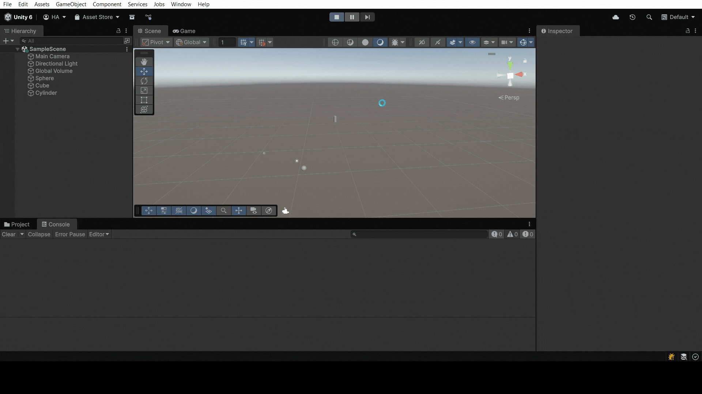

# Práctica 2 Interfaces Inteligentes. Introducción C# Scripts
En esta práctica se proponen 13 ejercicios para practicar la programación en C# de scripts que controlen el comportamiento de objetos en Unity.
Los ejercicios se encuentran en el siguiente [documento](https://docs.google.com/document/d/1p0Am7MJxXagUPGJYdfbOlIXrZ8P98eSOc6n9EaRr930/edit?tab=t.0)

---

## Ejercicio 1
*Crea un script asociado a un objeto en la escena que inicialice un vector de 3 posiciones con valores entre 0.0 y 1.0, para tomarlo como un vector de color (Color). Cada 120 frames se debe cambiar el valor de una posición aleatoria y asignar el nuevo color al objeto. Parametrizar la cantidad de frames de espera para poderlo cambiar desde el inspector.*

Para este ejercicio utilice la clase Random de Unity para generar los valores aleatorios entre 0.0 y 1.0. De manera que, creando un vector con esos valores, se puede asignar tanto la posición del objeto como su color (usando Color). Fue necesario obtener el componente Renderer del objeto para poder cambiar su color, así como usamos el transform del propio objeto con ```gameObject.transform.position```, aunque podía haberse obtenido el componente transform directamente.

Por último, para cambiar cada 120 frames, se utilizó la propiedad estática ```Time.frameCount``` que devuelve el número de frames desde que se inició la ejecución del juego. Así, comprobando si el frame actual es múltiplo de 120 se ejecuta el cambio de posición y color.

```csharp
using UnityEngine;

public class ChangePositionAndColor : MonoBehaviour {
  [SerializeField] private int framesToWait = 120;
  private Renderer objectRenderer;

  void Start() {
    objectRenderer = GetComponent<Renderer>();
  }

  void Update() {
    if (Time.frameCount % framesToWait == 0) {
      ChangeToRandomPosition();
      ChangeToRandomColor();
    }
  }

  void ChangeToRandomPosition() {
    Vector3 newPosition = new Vector3(UnityEngine.Random.Range(0.0f, 1.0f),
                                      UnityEngine.Random.Range(0.0f, 1.0f),
                                      UnityEngine.Random.Range(0.0f, 1.0f));
    gameObject.transform.position = newPosition;
  }
  void ChangeToRandomColor() {
    Color newColor = new Color(UnityEngine.Random.Range(0.0f, 1.0f),
                               UnityEngine.Random.Range(0.0f, 1.0f),
                               UnityEngine.Random.Range(0.0f, 1.0f));
    objectRenderer.material.color = newColor;
  }
}
```


## Ejercicio 2
*Crea un script asociado a la esfera con dos variables Vector3 públicas. Dale valor a cada componente de los vectores desde el inspector. Muestra en la consola:*
  1. *La magnitud de cada uno de ellos.* 
  2. *El ángulo que forman.*
  3. *La distancia entre ambos.*
  4. *Un mensaje indicando qué vector está a una altura mayor.*
*Muestra en el inspector cada uno de esos valores.*

Para resolver este ejercicio, se han utilizado las propiedades y métodos de la clase Vector3, como son ```magnitude```, ```Vector3.Angle``` y ```Vector3.Distance```. Además, se ha utilizado la propiedad y el método ```Debug.Log``` para mostrar los resultados en la consola de Unity.

```csharp
using UnityEngine;

public class VectorDisplay : MonoBehaviour {
  public Vector3 vectorA;
  public Vector3 vectorB;

  public float magnitudeA;
  public float magnitudeB;
  public float angleBetween;
  public float distanceBetween;
  public string higherVectorMessage;

  void Update() {
    magnitudeA = vectorA.magnitude;
    magnitudeB = vectorB.magnitude;
    angleBetween = Vector3.Angle(vectorA, vectorB);
    distanceBetween = Vector3.Distance(vectorA, vectorB);
    if (vectorA.y > vectorB.y) {
      higherVectorMessage = "Vector A is higher than Vector B";
    }
    else if (vectorA.y < vectorB.y) {
      higherVectorMessage = "Vector B is higher than Vector A";
    }
    else {
      higherVectorMessage = "Both vectors are at the same height";
    }
    Debug.Log("Magnitude of Vector A: " + magnitudeA);
    Debug.Log("Magnitude of Vector B: " + magnitudeB);
    Debug.Log("Angle between Vector A and Vector B: " + angleBetween);
    Debug.Log("Distance between Vector A and Vector B: " + distanceBetween);
    Debug.Log(higherVectorMessage);
  }
}
```


## Ejercicio 3
*Muestra en pantalla el vector con la posición de la esfera.*

En este caso, se han propuesto usar tanto la propiedad ```transform.position```, que obtiene el transform del objeto asociado al script directamente, como el método ```GetComponent<Transform>().position``` que obtiene el componente Transform del objeto usando el método GetComponent. Ambos métodos devuelven la posición del objeto en el espacio 3D, que es un vector de 3 componentes (Vector3).

```csharp
using UnityEngine;

public class ShowVector : MonoBehaviour {
  void Update() {
    Debug.Log("Position Vector: " + transform.position);
    Debug.Log("Position Vector (GetComponent): " + GetComponent<Transform>().position); // Alternativa
  }
}
```


## Ejercicio 4
*Crea un script para la esfera que muestre en consola la distancia a la que están el cubo y el cilindro.*

En esta ocasión, creamos dos variables privadas de tipo Transform para almacenar las referencias a los objetos cubo y cilindro. En el método Start, usamos ```GameObject.FindWithTag``` para encontrar los objetos en la escena mediante sus etiquetas (tags) y obtener sus componentes Transform. Al usar *SerializeField*, podemos asignar las referencias desde el inspector si lo deseamos en lugar de buscarlas en Start. Luego, en el método Update, calculamos la distancia entre la posición de la esfera (el objeto al que está asociado el script) y las posiciones del cubo y cilindro usando ```Vector3.Distance```.

```csharp
using UnityEngine;

public class DistanceToCubeAndCylinder : MonoBehaviour {
  [SerializeField] private Transform cubeTransform;
	[SerializeField] private Transform cylinderTransform;

	void Start() {
		cubeTransform = GameObject.FindWithTag("Cube").transform;
		cylinderTransform = GameObject.FindWithTag("Cylinder").transform;
	}

	void Update() {
		float distanceToCube = Vector3.Distance(transform.position, cubeTransform.position);
		float distanceToCylinder = Vector3.Distance(transform.position, cylinderTransform.position);

		Debug.Log("Distance to Cube: " + distanceToCube);
		Debug.Log("Distance to Cylinder: " + distanceToCylinder);
	}
}
```



## Ejercicio 5
*Selecciona tres posiciones en tu escena a través de un objeto invisible (marcador) que incluya 3 vectores numéricos para configurar posiciones en las que quieres ubicar los objetos en respuesta a pulsar la barra espaciadora. Estos vectores representan un desplazamiento respecto a la posición original de cada objeto. Crea un script que ubique en las posiciones configuradas cuando el usuario pulse la barra espaciadora.*

Para este ejercicio, se han creado tres variables privadas de tipo Vector3 para almacenar los desplazamientos configurados desde el inspector. Además, se han creado tres variables privadas de tipo Transform para almacenar las referencias a los objetos que se van a mover (marcadores). En el método Update, se comprueba si la barra espaciadora está siendo pulsada usando ```Input.GetAxis("Jump")```, y si es así, se actualizan las posiciones de los objetos sumando los desplazamientos correspondientes a sus posiciones actuales.

```csharp
using UnityEngine;

public class DisplaceFromVector : MonoBehaviour {
  [SerializeField] private Vector3 displacement1;
  [SerializeField] private Vector3 displacement2;
  [SerializeField] private Vector3 displacement3;

  [SerializeField] private Transform markerTransform1;
  [SerializeField] private Transform markerTransform2;
  [SerializeField] private Transform markerTransform3;

  void Update() {
    if (Input.GetAxis("Jump") > 0) {
      markerTransform1.position = markerTransform1.position + displacement1;
      markerTransform2.position = markerTransform2.position + displacement2;
      markerTransform3.position = markerTransform3.position + displacement3;
    }
  }
}
```


## Ejercicio 6
*Agrega un campo velocidad a un cubo y asígnale un valor que se pueda cambiar en el inspector de objetos. Muestra la consola el resultado de multiplicar la velocidad por el valor del eje vertical y por el valor del eje horizontal cada vez que se pulsan las teclas flecha arriba-abajo ó flecha izquierda-derecha. El mensaje debe comenzar por el nombre de la flecha pulsada.*

En este caso, se ha creado una variable privada de tipo float para almacenar la velocidad, que se puede configurar desde el inspector gracias a *SerializeField*. En el método Update, se obtienen los valores de los ejes vertical y horizontal usando ```Input.GetAxis("Vertical")``` e ```Input.GetAxis("Horizontal")```. Si alguno de estos valores es distinto de cero (lo que indica que se está pulsando alguna de las teclas correspondientes), se calcula la velocidad multiplicando el valor del eje por la velocidad configurada y se muestra un mensaje en la consola indicando qué tecla se ha pulsado y cuál es la velocidad resultante. Además, se muestra por consola si se ha pulsado la flecha arriba, abajo, izquierda o derecha con ```Debug.Log```.

```csharp
using UnityEngine;

public class VelocityAxis : MonoBehaviour {
  [SerializeField] private float velocity = 5f;

  void Update() {
    float verticalInput = Input.GetAxis("Vertical");
    float horizontalInput = Input.GetAxis("Horizontal");

    if (verticalInput != 0) {
      float verticalVelocity = velocity * verticalInput;
      if (verticalInput > 0) {
        Debug.Log("Up Arrow Pressed: Vertical Velocity = " + verticalVelocity);
      } else {
        Debug.Log("Down Arrow Pressed: Vertical Velocity = " + verticalVelocity);
      }
    }

    if (horizontalInput != 0) {
      float horizontalVelocity = velocity * horizontalInput;
      if (horizontalInput > 0) {
        Debug.Log("Right Arrow Pressed: Horizontal Velocity = " + horizontalVelocity);
      } else {
        Debug.Log("Left Arrow Pressed: Horizontal Velocity = " + horizontalVelocity);
      }
    }
  }
}
```

## Ejercicio 7
*Mapea la tecla H a la función disparo. *

Para mapear la tecla H a la función disparo, se ha usado el Input Manager: Edit -> Project Settings -> Input Manager. Allí, se ha añadido a las actions de attack una nueva entrada para la tecla H.


## Ejercicio 8
*Crea un script asociado al cubo que en cada iteración traslade al cubo una cantidad proporcional un vector que indica la dirección del movimiento: moveDirection que debe poder modificarse en el inspector.  La velocidad a la que se produce el movimiento también se especifica en el inspector, con la propiedad speed. Inicialmente la velocidad debe ser mayor que 1 y el cubo estar en una posición y=0. En el informe de la práctica comenta los resultados que obtienes en cada una de las siguientes situaciones:*
  1. *duplicas las coordenadas de la dirección del movimiento.*
  2. *duplicas la velocidad manteniendo la dirección del movimiento.*
  3. *la velocidad que usas es menor que 1*
  4. *la posición del cubo tiene y>0*
  5. *intercambiar movimiento relativo al sistema de referencia local y el mundial.*

Como solución al ejercicio, se ha creado un script que traslada el cubo en la dirección especificada por el vector ```moveDirection``` un vector editable desde el inspector, que comienza con el valor (1,0,0) para mover el cubo en el eje X. 
La velocidad del movimiento se controla mediante la variable ```speed```, también editable desde el inspector y con un valor inicial de 2. 
En primer lugar, en el método Start, se inicializa la posición del cubo para que su coordenada Y sea 0, independientemente de la posición que tenga en la escena.
En el método Update, se proponen varias formas de mover el cubo, tanto usando ```transform.Translate``` como modificando directamente la posición del cubo con ```transform.position += ...```. Usando ```Space.World``` en ```transform.Translate```, el movimiento es relativo al sistema de referencia mundial, mientras que usando ```Space.Self```, el movimiento es relativo al sistema de referencia local del cubo.

1. Al duplicar las coordenadas de la dirección del movimiento, el cubo se mueve el doble de rápido en la dirección especificada.

2. Al duplicar la velocidad manteniendo la dirección del movimiento, el cubo se mueve el doble de rápido en la misma dirección.

3. Cuando la velocidad es menor que 1, el cubo se mueve en la dirección opuesta al vector de movimiento.

4. Cuando la posición del cubo tiene y>0, el cubo se mueve en la dirección especificada por el vector de movimiento, pero su altura (y) no afecta su movimiento horizontal.

5. Al intercambiar entre movimiento relativo al sistema de referencia local y mundial, el cubo se mueve en la dirección del vector de movimiento en el sistema mundial, mientras que en el sistema local, el movimiento depende de la orientación actual del cubo. De manera que si este está rotado, el movimiento será en una dirección "diferente a la del vector de movimiento".


```csharp
using UnityEngine;

public class TranslateWithVelocity : MonoBehaviour {
  [SerializeField] private Vector3 moveDirection = new Vector3(1, 0, 0);
  [SerializeField] private float speed = 2f;

  void Start() {
    Vector3 startPosition = transform.position;
    startPosition.y = 0;
    transform.position = startPosition;
  }

  void Update() {
    // Movimiento relativo al sistema de referencia mundial
    transform.Translate(moveDirection * speed * Time.deltaTime, Space.World);
    // transform.Translate(moveDirection.x * speed * Time.deltaTime, moveDirection.y * speed * Time.deltaTime, moveDirection.z * speed * Time.deltaTime, Space.World);
    // transform.position += moveDirection * speed * Time.deltaTime;

    // Movimiento relativo al sistema de referencia local
    // transform.Translate(moveDirection * speed * Time.deltaTime, Space.Self);
    // transform.position += transform.TransformDirection(moveDirection) * speed * Time.deltaTime;
  }
}
```

## Ejercicio 9
*Mueve el cubo con las teclas de flecha arriba-abajo, izquierda-derecha a la velocidad speed. Cada uno de estos ejes implican desplazamientos en el eje vertical y horizontal respectivamente. Mueve la esfera con las teclas w-s (movimiento vertical) a-d (movimiento horizontal).*

Para ello, se ha creado un script que obtiene los valores de los ejes vertical y horizontal usando ```Input.GetKey``` para detectar las pulsaciones de las teclas de las flechas. Dependiendo de las teclas pulsadas, se actualizan las variables ```verticalInput``` y ```horizontalInput``` como 1 o -1. De manera que, al calcular el vector de movimiento multiplicando estos valores, se mueve en la dirrección objetivo. Además, se multiplica también por la velocidad configurada para aumentar o disminuir la velocidad de movimiento. Finalmente, se usa ```transform.Translate``` para mover el objeto en la dirección calculada.

```csharp
using UnityEngine;

public class MovingWithArrows : MonoBehaviour {
  [SerializeField] private float speed = 5f;

  void Update() {
    float verticalInput = 0f;
    float horizontalInput = 0f;

    if (Input.GetKey(KeyCode.UpArrow)) verticalInput = 1f;
    if (Input.GetKey(KeyCode.DownArrow)) verticalInput = -1f;
    if (Input.GetKey(KeyCode.RightArrow)) horizontalInput = 1f;
    if (Input.GetKey(KeyCode.LeftArrow)) horizontalInput = -1f;

    Vector3 movement = new Vector3(horizontalInput, verticalInput, 0) * speed;
    transform.Translate(movement, Space.World);
  }
}
```


## Ejercicio 10
*Adapta el movimiento en el ejercicio 9 para que sea proporcional al tiempo transcurrido durante la generación del frame.*

Al script anterior se le modificó el vector de movimiento para que se multiplica también por ```Time.deltaTime```. De esta forma aseguramos que el movimiento sea independiente de la tasa de frames.

```csharp
using UnityEngine;
public class MovingWithArrows : MonoBehaviour {
  [SerializeField] private float speed = 5f;

  void Update() {
    float verticalInput = 0f;
    float horizontalInput = 0f;

    if (Input.GetKey(KeyCode.UpArrow)) verticalInput = 1f;
    if (Input.GetKey(KeyCode.DownArrow)) verticalInput = -1f;
    if (Input.GetKey(KeyCode.RightArrow)) horizontalInput = 1f;
    if (Input.GetKey(KeyCode.LeftArrow)) horizontalInput = -1f;

    // Vector3 movement = new Vector3(horizontalInput, verticalInput, 0) * speed;
    Vector3 movement = new Vector3(horizontalInput, verticalInput, 0) * speed * Time.deltaTime; // Adapted for frame rate independence
    transform.Translate(movement, Space.World);
  }
}
```


## Ejercicio 11
*Adapta el movimiento en el ejercicio 10 para que el cubo se mueva hacia la posición de la esfera. Debes considerar que el avance no debe estar influenciado por cuánto de lejos o cerca estén los dos objetos.*

Para lograr esto hemos creado un script que obtiene la posición de la esfera usando ```GameObject.FindWithTag("Sphere")``` para encontrar el objeto en la escena mediante su etiqueta (tag) y obtener su componente Transform. Luego, en el método Update, tenemos dos variantes de movimiento hacia la esfera: una que mueve el cubo siempre hacia la esfera, y otra que solo mueve el cubo hacia la esfera cuando se pulsan las teclas de flecha. En ambos casos, se calcula la dirección hacia la esfera restando la posición del cubo a la posición de la esfera, y se normaliza este vector para que su magnitud sea 1. Finalmente, se usa ```transform.Translate``` para mover el cubo en la dirección calculada, multiplicando por la velocidad y por ```Time.deltaTime``` para asegurar que el movimiento sea independiente de la tasa de frames.

```csharp
using UnityEngine;

public class MovingToSphere : MonoBehaviour {
  private Transform sphereTransform;
  [SerializeField] private float speed = 2f;

  void Start() {
    sphereTransform = GameObject.FindWithTag("Sphere").transform;
  }

  void Update() {
    AlwaysMoveToSphere();
    // MoveToSphereWithInput();
  }

  void AlwaysMoveToSphere() {
    Vector3 directionToSphere = sphereTransform.position - transform.position;
    transform.Translate(directionToSphere.normalized * speed * Time.deltaTime, Space.World);
  }

  void MoveToSphereWithInput() {
    float verticalInput = 0f;
    float horizontalInput = 0f;

    if (Input.GetKey(KeyCode.UpArrow))
      verticalInput = 1f;
    if (Input.GetKey(KeyCode.DownArrow))
      verticalInput = -1f;
    if (Input.GetKey(KeyCode.RightArrow))
      horizontalInput = 1f;
    if (Input.GetKey(KeyCode.LeftArrow))
      horizontalInput = -1f;

    Vector3 directionToSphere = sphereTransform.position - transform.position;
    directionToSphere.x *= horizontalInput;
    directionToSphere.y *= verticalInput;
    transform.Translate(directionToSphere.normalized * speed * Time.deltaTime, Space.World);
  }
}
```


## Ejercicio 12
*Adapta el movimiento en el ejercicio 11 de forma que el cubo avance mirando siempre hacia la esfera, independientemente de la orientación de su sistema de referencia. Para ello, el cubo debe girar de forma que el eje Z positivo apunte hacia la esfera . Realiza pruebas cambiando la posición de la esfera mediante las teclas awsd.*

En este caso, se ha creado un script que combina el movimiento hacia la esfera con la rotación del cubo para que siempre mire hacia la esfera. En el método Update, se llama a dos funciones: ```LookAtObject``` y ```MovingWithArrows```. La función ```LookAtObject``` utiliza ```transform.LookAt``` para hacer que el cubo mire hacia la posición de la esfera. La función ```MovingWithArrows``` permite mover el cubo usando las teclas de flecha, similar a los anteriores, pero ahora el cubo siempre estará orientado hacia la esfera mientras se mueve.

```csharp
using UnityEngine;

public class AlwaysLookingTo : MonoBehaviour {
  [SerializeField] private Transform lookingToTransform;
  [SerializeField] private float speed = 4f;

  void Start() {
    lookingToTransform = GameObject.FindWithTag("Sphere").transform;
  }

  void Update() {
    LookAtObject();
    MovingWithArrows();
  }

  void LookAtObject() {
    transform.LookAt(lookingToTransform);
  }

  void MovingWithArrows() {
    float verticalInput = 0f;
    float horizontalInput = 0f;

    if (Input.GetKey(KeyCode.UpArrow)) verticalInput = 1f;
    if (Input.GetKey(KeyCode.DownArrow)) verticalInput = -1f;
    if (Input.GetKey(KeyCode.RightArrow)) horizontalInput = 1f;
    if (Input.GetKey(KeyCode.LeftArrow)) horizontalInput = -1f;

    Vector3 movement = new Vector3(horizontalInput, verticalInput, 0) * speed * Time.deltaTime; // Adapted for frame rate independence
    transform.Translate(movement, Space.World);
  }
}
```


## Ejercicio 13
*Utilizar el eje “Horizontal” para girar el objetivo y que avance siempre en la dirección hacia adelante.*

Para este ejercicio, se ha creado un script que rota el cubo alrededor del eje Y (vertical) en función del valor del eje "Horizontal" obtenido con ```Input.GetAxis("Horizontal")```. Luego, el cubo avanza siempre en la dirección hacia adelante (su eje Z positivo) usando ```transform.Translate``` con ```transform.forward```. La velocidad de rotación y de avance se pueden configurar desde el inspector mediante las variables ```rotationSpeed``` y ```speed```.

```csharp
using UnityEngine;
public class AlwaysMovingForward : MonoBehaviour {
  [SerializeField] private float speed = 4f;
  [SerializeField] private float rotationSpeed = 100f;

  void Update() {
    float horizontalInput = Input.GetAxis("Horizontal");
    transform.Rotate(Vector3.up, horizontalInput * rotationSpeed * Time.deltaTime);
    transform.Translate(transform.forward * speed * Time.deltaTime, Space.World);
  }
}
```